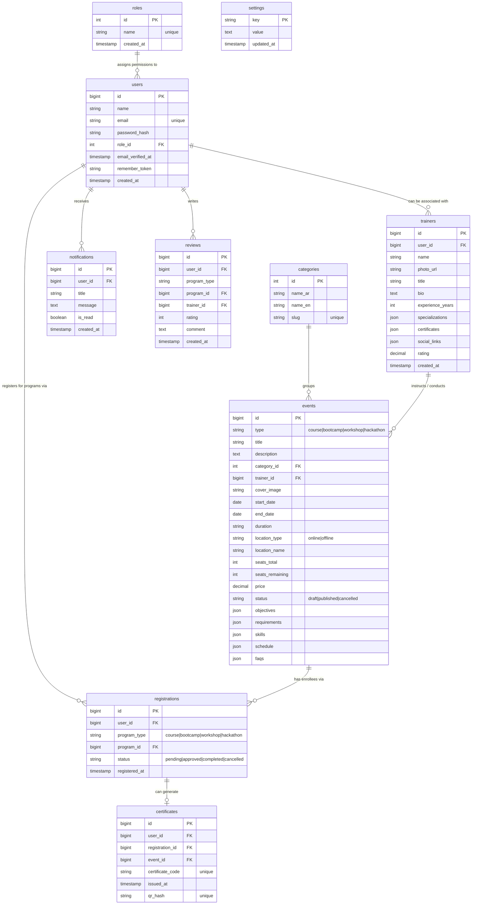

# Entity Relationship Diagram (ERD) & UI Wireframes

This document details the visual ER diagram (using Mermaid.js notation) and the interface wireframes for the **DAICO** web platform.

---

## 1. Entity Relationship Diagram (ERD)

The following Mermaid diagram models the relational tables, keys, fields, and constraints of the DAICO database.



---

## 2. UI Wireframes

Below are the layout wireframes representing the core user flows.

### 2.1 Wireframe: Homepage (`index.html`)
```
+-----------------------------------------------------------------------------------+
| [Logo] DAICO               (About)  (Programs)  (Trainers)  [Light/Dark] [Login]  |
+-----------------------------------------------------------------------------------+
|                                                                                   |
|                      [Badge: The First Innovation Academy]                        |
|                  Vibrant Title: Shape the Future of Tech With Us                  |
|          Description: Join advanced bootcamps, workshops, and hackathons...       |
|                                                                                   |
|                           [Browse Programs]  [About Us]                           |
|                                                                                   |
+-----------------------------------------------------------------------------------+
|  [ 12,500+ Students ]   [ 140+ Courses ]   [ 25+ Experts ]   [ 94% Hired ]        |
+-----------------------------------------------------------------------------------+
|  FEATURED PROGRAMS:                                                               |
|  [All]  [Courses]  [Bootcamps]  [Hackathons]  [Workshops]                         |
|                                                                                   |
|  +--------------------+  +--------------------+  +--------------------+           |
|  | [Image] [Bootcamp] |  | [Image] [Course]   |  | [Image] [Workshop] |           |
|  | Title: CyberSec    |  | Title: Laravel/Next|  | Title: Figma UI/UX |           |
|  | Date | Price: 1500 |  | Date | Price: Free |  | Date | Price: 99   |           |
|  | Trainer Info       |  | Trainer Info       |  | Trainer Info       |           |
|  | [Details & Register]|  | [Details & Register]|  | [Details & Register]|          |
|  +--------------------+  +--------------------+  +--------------------+           |
+-----------------------------------------------------------------------------------+
|  FAQS SECTION (Accordions):                                                       |
|  > Q: How do I enroll in free courses?                                            |
|  > Q: Are certificates accredited and verified?                                   |
+-----------------------------------------------------------------------------------+
|  CONTACT FORM:                                                                    |
|  Name:    [                    ]      Address Details:                            |
|  Email:   [                    ]      Email: info@daico.edu.sa                    |
|  Message: [                    ]      Phone: +966 11 400 9000                     |
|           [Submit Message]                                                        |
+-----------------------------------------------------------------------------------+
| © 2026 DAICO. All rights reserved.                   Made Proudly in Saudi Arabia |
+-----------------------------------------------------------------------------------+
```

---

### 2.2 Wireframe: Auth Screen (`login.html` / `register.html`)
```
+----------------------------------------------------------+
|                        DAICO LOGO                        |
|                       Secure Login                       |
|           Please enter credentials to continue.          |
+----------------------------------------------------------+
|  [Alert Message Box - Success / Error]                   |
|                                                          |
|  Email:                                                  |
|  [ student@daico.edu.sa                                ] |
|                                                          |
|  Password:                                               |
|  [ ••••••••••••••••                                    ] |
|                                                          |
|  [x] Remember me                        Forgot Password? |
|                                                          |
|  [               Secure Submit Log In                  ] |
+----------------------------------------------------------+
|  Don't have an account? Sign Up   |  <- Go back to Home  |
+----------------------------------------------------------+
```

---

### 2.3 Wireframe: User Dashboard (`user/index.html`)
```
+------------------+----------------------------------------------------------------+
| DAICO ACADEMY    | Welcome, Student Name!                              [Notif] [T]|
+------------------+----------------------------------------------------------------+
| (Active Options) | BROWSE TRAINING PROGRAMS                                       |
|                  |                                                                |
| * Browse events  | [Courses]  [Bootcamps]  [Hackathons]  [Workshops]              |
| * Enrolled Logs  |                                                                |
|                  | [ Search Input... ] [Category Select] [Location] [Free/Paid]   |
|                  |                                                                |
| 👤 Student       | +--------------------+ +--------------------+ +----------------+ |
| [Log Out]        | | [Image]            | | [Image]            | | [Image]        | |
|                  | | Title: CyberSec    | | Title: Next.js API | | Title: UX/UI   | |
|                  | | Free | Zoom        | | 400 SAR | Hybrid   | | Free | Zoom    | |
|                  | | [Details Modal]    | | [Details Modal]    | | [Details Modal]| |
|                  | +--------------------+ +--------------------+ +----------------+ |
+------------------+----------------------------------------------------------------+
```

#### Detailed Event Modal View:
```
+-----------------------------------------------------------------------------------+
| [X] Detailed Program: Next.js API & Laravel Integration                           |
+-----------------------------------------------------------------------------------+
|  [==== Cover Image Header ====]                                                   |
|                                                                                   |
|  Description: Complete core training on RESTful APIs ...                          |
|                                                                                   |
|  Objectives:                  Requirements:              Session Parameters:       |
|  * Build Laravel APIs         * JavaScript Basics        * Length: 40 Hours        |
|  * Client-side Query hooks    * Database foundations     * Seats: 12 left / 50     |
|                                                          * Price: 499 SAR          |
|  Schedule Outline:            Skills Acquired:           * Place: Online (Zoom)    |
|  * W1: Laravel API structure  [Laravel] [Next.js]                                 |
|  * W2: React state hooks                                                          |
|                                                          Trainer Information:      |
|  FAQs:                                                   [Photo] Khaled Al-Harbi   |
|  * Q: Are sessions recorded?                             Senior Architect (12y)    |
|    A: Yes, uploaded next day.                            "Expert in system design."|
|                                                                                   |
|  +-----------------------------------------------------------------------------+  |
|  |                            [ Register Seat Now ]                            |  |
|  +-----------------------------------------------------------------------------+  |
+-----------------------------------------------------------------------------------+
```

---

### 2.4 Wireframe: Admin Dashboard (`admin/index.html`)
```
+------------------+----------------------------------------------------------------+
| DAICO CONTROL    | Welcome Admin, Sara Al-Otaibi                       [Notif] [T]|
+------------------+----------------------------------------------------------------+
| * Analytics Stats| ANALYTICS WIDGETS                                              |
| * Programs CRUD  | [ Total Users: 1,420 ]             [ Active Programs: 15 ]     |
| * Registrations  | [ Total Enrollments: 450 ]         [ Active Trainers: 3 ]      |
| * Users & Rights |                                                                |
| * Certificates   | [Export Excel Report]                        [Export PDF Report]|
| * Announcements  |                                                                |
| * Settings Editor| RECENT COMPLETED REGISTRATIONS & ACTIVITY                     |
|                  | +--------------------+--------------------+-------------------+ |
| 👤 Admin         | | Student Name       | Applied Program    | Action Status     | |
| [Log Out]        | +--------------------+--------------------+-------------------+ |
|                  | | Ahmad Al-Malki     | Next.js API        | [Approved]        | |
|                  | | Sara Salem         | Cybersecurity      | [Completed]       | |
|                  | +--------------------+--------------------+-------------------+ |
+------------------+----------------------------------------------------------------+
```
